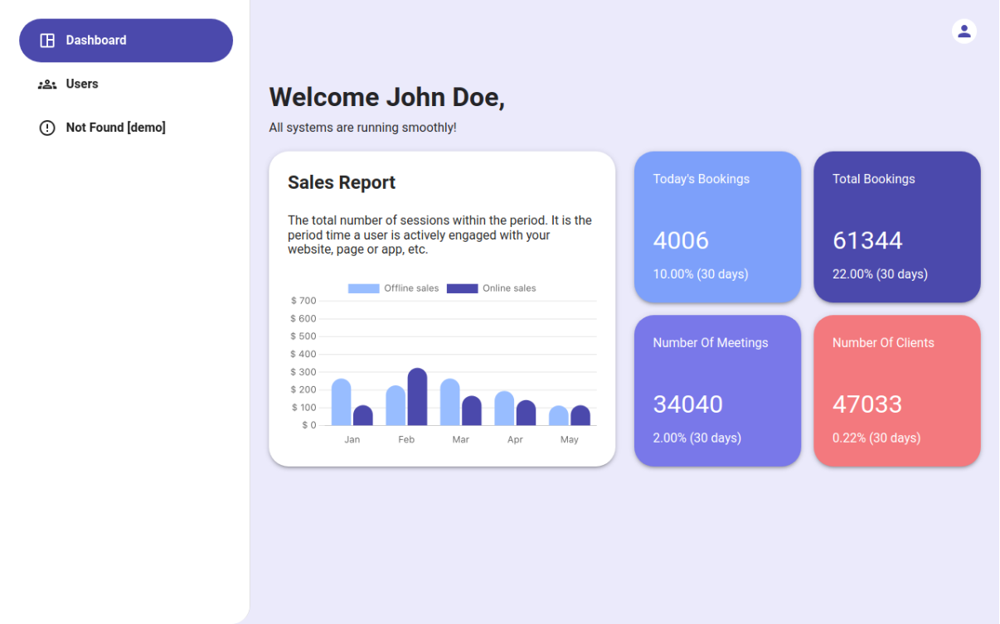

# React + React MUI Admin Panel Demo

## Overview

This demo showcases a slice of an admin panel built with React, Typescript and Material-UI (MUI). It features custom button component, a dynamic chart, a responsive table, and navigation between two distinct routes. Ideal for developers looking for a modern, sleek design in admin interfaces with the flexibility of React.

## Features

- Custom Button: Designed button setups.
- Dynamic Chart: Visually represent data.
- Responsive Table: Display complex datasets with ease.
- Navigation: Smooth routing between simulated pages + responsive Header and Sidebar implementation.

## Technologies

- React: A JavaScript library for building user interfaces.
- React MUI: A comprehensive library of Material Design components for React.
- Material-react-table: A comprehensive library for creating custom tables.
- Chart.js + react-chartjs-2: Chart libraries for creating data visualization.
